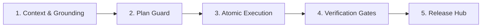

# Agentic Team Playbook: Metodología y Guardrails de Ingeniería para Equipos con IA

> **Framework de trabajo colaborativo entre desarrolladores humanos y agentes de inteligencia artificial (Antigravity, Cursor, Claude Code, GitHub Copilot) implementado nativamente en DevBoard.**

---

## 1. Fundamentos y Filosofía

El desarrollo de software con agentes de IA no puede operar como un chat informal o un generador de código descontrolado ("vibe coding"). Sin estructuras rígidas de contención, los proyectos sufren de:
* **Deriva de alcance (Scope Creep):** Agentes reescribiendo módulos enteros sin solicitud previa.
* **Alucinaciones silenciosas:** Suposiciones sobre arquitecturas inexistentes o APIs obsoletas.
* **Desfase de backlog:** Código que avanza a espaldas de la documentación y la planificación del equipo.
* **Deuda técnica acelerada:** Código parche sobre parche sin validación de arquitectura ni pruebas.

El **Agentic Team Playbook** establece un contrato de ingeniería explícito que convierte al agente de IA en un par disciplinado, transparente y de alta precisión.

---

## 2. Matriz de Roles

| Rol | Agente / Humano | Responsabilidades Principales |
| :--- | :--- | :--- |
| **Product Owner & Tech Lead** | 👤 Desarrollador Humano | Define prioridades de negocio, valida planes técnicos, realiza code reviews y autoriza releases. |
| **Architect Agent** | 🤖 Agente de IA | Investiga dependencias, analiza patrones del repositorio, diseña soluciones desacopladas y produce planes técnicos antes de codificar. |
| **Pair Programmer Agent** | 🤖 Agente de IA | Ejecuta código de forma atómica e incremental, respeta contratos tipados, actualiza criterios de aceptación en tiempo real. |
| **QA & Verification Guard** | 🤖 / ⚙️ Hook Automatizado | Audita tipado, ejecuta suites de prueba, intercepta commits desfasados mediante `.githooks/pre-commit`. |

---

## 3. Las 5 Fases del Ciclo de Vida

### Fase 1: Context & Grounding (Anclaje de Contexto)
* Ningún agente comienza a codificar sin haber anclado su contexto en una tarea de `backlog/tasks/<ID> - <Título>.md`.
* Se leen los requerimientos (`<!-- SECTION:DESCRIPTION:BEGIN -->`) y los criterios de aceptación (`<!-- AC:BEGIN -->`).
* Si el requerimiento es nuevo, se crea la tarea primero utilizando `devboard_create_task` o en Markdown.

### Fase 2: Plan Guard (Barrera de Planificación)
* Para cambios que afecten arquitectura, dependencias o múltiples archivos:
  1. El agente formula un plan paso a paso en la sección `<!-- SECTION:PLAN:BEGIN -->` de la tarea (o en `implementation_plan.md`).
  2. El Tech Lead revisa y aprueba el enfoque antes de que se modifique el código.
* **Regla de Oro:** *"Planifica antes de escribir; no corrijas en caliente lo que no entendiste al diseñar."*

### Fase 3: Atomic Incremental Execution (Ejecución Atómica)
* La tarea pasa a `status: doing`.
* Cada criterio de aceptación completado se tilda en tiempo real (`- [x]` o `toggleAcIndex`).
* El agente no altera archivos ajenos al alcance de la tarea.

### Fase 4: Verification Gates (Puertas de Verificación)
* Validación de tipos estricta (`npm run build` o `npx tsc --noEmit`).
* Verificación de suites automatizadas (`npm run backlog:check`).
* El hook Git [`.githooks/pre-commit`](../.githooks/pre-commit) valida la coherencia: si una tarea tiene 100% de criterios cumplidos pero sigue en `draft` o `doing`, el commit se bloquea automáticamente.

### Fase 5: Release Hub & Traceability (Liberación y Trazabilidad)
* Las tareas resueltas pasan a `ready` o `done`.
* El archivo Markdown de la tarea se incluye **en el mismo commit de Git** que el código fuente.
* Al empaquetar una versión con el Release Assembler, se generan notas en `backlog/releases.json` y se actualiza el consolidado [`BACKLOG.md`](../BACKLOG.md).

---

## 4. Guardrails de Contención Estricta

1. **Código sin Tarea no Existe:**
   Cualquier Pull Request o commit sin una tarea asociada en `backlog/tasks/` se considera deuda técnica o código no verificado.
2. **Prohibición de Destrucción Histórica:**
   Las tareas en `done` jamás se borran del disco; son el registro de auditoría de por qué el código es como es. Si una tarea se cancela, pasa a `dismissed` y se mueve a `backlog/archive/`.
3. **Soberanía y Cero Secretos:**
   Las tareas jamás deben contener credenciales, tokens, contraseñas o URLs de bases de datos productivas.
4. **Dogfooding Continuo:**
   DevBoard se desarrolla utilizando DevBoard. Todo agente trabajando en este repositorio debe utilizar las herramientas MCP (`devboard_*`) y respetar el estándar **Backlog.md**.
