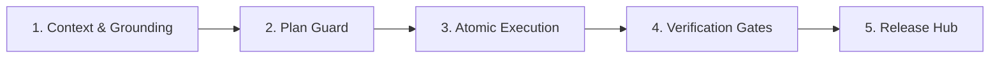

# Agentic Team Playbook: Metodología y Guardrails de Ingeniería para Equipos con IA

> **Framework de trabajo colaborativo entre desarrolladores humanos y agentes de inteligencia artificial (Antigravity, Cursor, Claude Code, GitHub Copilot) implementado nativamente en DevBoard.**

---

## 1. Fundamentos y Filosofía

El desarrollo de software con agentes de IA no puede operar como un chat informal o un generador de código descontrolado (*"vibe coding"*). Sin estructuras de contención y disciplina operativa, los proyectos sufren de:
* **Deriva de alcance (Scope Creep):** Agentes reescribiendo módulos enteros sin solicitud previa.
* **Alucinaciones silenciosas:** Suposiciones sobre arquitecturas inexistentes, APIs obsoletas o dependencias ausentes.
* **Desfase de backlog:** Código que avanza a espaldas de la documentación y la planificación del equipo.
* **Deuda técnica y bugs de UX recurrentes:** Código parche sobre parche con saltos de scroll, touch targets diminutos o regresiones visuales.

El **Agentic Team Playbook** establece un contrato de ingeniería explícito que convierte a los agentes de IA en un equipo disciplinado, transparente, seguro y de alta velocidad.

---

## 2. 🚦 Matriz de Decisión Dinámica (Autonomía y Velocidad Operativa)

Para erradicar la ineficiencia y evitar sobrecarga burocrática en tareas menores, el sistema clasifica automáticamente el requerimiento en uno de los siguientes **3 modos operativos**:

| Modo Operativo | Disparadores Típicos | Roles Involucrados | Flujo / Sobrecarga |
| :--- | :--- | :--- | :--- |
| **Modo 1: Foco Quirúrgico** *(Fast-Track)* | Bugfix puntual, corrección de tipado (`tsc`), micro-ajuste de CSS/copy, fix de scroll puntual, warnings de linter. | **Principal Engineer** (control directo y exclusivo). | **Cero burocracia documental.** Cambio atómico en código + validación (`npm run build`). |
| **Modo 2: Dúo Táctico** *(Diseño + Código)* | Rediseño de componentes visuales (`ItemModal`, `FilterBar`, `ItemCard`), micro-interacciones, ergonomía táctil, layout responsive. | **Product Designer** + **Principal Engineer** (+ QA check). | **Ligero.** Especificación directa en plan de chat o en la tarea asociada en `backlog/tasks/`. |
| **Modo 3: Backlog Flow Completo** | Feature nueva de envergadura, personalización de columnas Kanban, motor de sincronización Markdown/JSON, servidor MCP. | Loop completo: **Market Researcher** -> **Product Designer** -> **Principal Engineer** -> **QA Sentinel**. | **Formal.** Tarea en `backlog/tasks/` con criterios de aceptación detallados, plan técnico previo y verificación en navegador. |

---

## 3. Matriz de Roles y Skills Especializadas

Los roles del equipo están respaldados por skills operativas integradas en [`.agents/skills/`](file:///Users/adrisol/Pablo/code/dev-board/.agents/skills/):

| Rol | Agente / Humano | Skill Vinculada | Responsabilidades Principales |
| :--- | :--- | :--- | :--- |
| **Product Owner & Tech Lead** | 👤 Desarrollador Humano | — | Define prioridades de negocio, valida planes técnicos, realiza code reviews y autoriza commits y releases. |
| **Architect & Principal Engineer** | 🤖 Agente de IA | [`principal-engineer`](file:///Users/adrisol/Pablo/code/dev-board/.agents/skills/principal-engineer/SKILL.md) | TypeScript estricto (cero `any`), optimización a 60 FPS en Kanban, sincronización atómica con Markdown/JSON y estabilidad del MCP. |
| **World-Class Product Designer** | 🤖 Agente de IA | [`worldclass-product-designer`](file:///Users/adrisol/Pablo/code/dev-board/.agents/skills/worldclass-product-designer/SKILL.md) | Estética estilo Linear/Notion, tokens semánticos refinados, micro-animaciones `active:scale-[0.98]` y ergonomía para power users. |
| **QA Sentinel & UX Auditor** | 🤖 / ⚙️ Hook Automatizado | [`rigorous-qa-auditor`](file:///Users/adrisol/Pablo/code/dev-board/.agents/skills/rigorous-qa-auditor/SKILL.md) [`code-level-ux-auditor`](file:///Users/adrisol/Pablo/code/dev-board/.agents/skills/code-level-ux-auditor/SKILL.md) | Guardián pre-entrega: validación estricta de build, coherencia de backlog, auditoría estática (`npm run audit:ux`) y pruebas en vivo con browser subagents. |
| **Market & Agile Researcher** | 🤖 Agente de IA | [`market-researcher`](file:///Users/adrisol/Pablo/code/dev-board/.agents/skills/market-researcher/SKILL.md) | Benchmarking acelerado contra referentes líderes (Linear, Jira, GitHub Projects, Height, Notion) para resolver UX sin intuición vacía. |
| **List & Views Architect** | 🤖 Agente de IA | [`list-views-filters`](file:///Users/adrisol/Pablo/code/dev-board/.agents/skills/list-views-filters/SKILL.md) | Arquitectura de barras de filtrado unificadas (`FilterBar`), popovers con contadores, reseteo rápido y estados vacíos diferenciados. |

---

## 4. 🤖 Autonomía de Subagentes: ¿Cuándo sumar manos vs. Cuándo mantener foco?

> **Regla de Oro:** *"Foco absoluto en la lógica central y parsers de datos; manos paralelas en la exploración y verificación visual."*

### 🟢 Cuándo SÍ sumar manos (Subagentes / Tareas Paralelas):
1. **Auditoría de QA y Navegación Autónoma (`browser_subagent`):**
   - Al concluir un cambio de interfaz visual (`KanbanBoard`, `ItemModal`, `FilterBar`), despachar un subagente de navegador para navegar, probar drag-and-drop, evaluar tecla `Escape` y detectar errores de consola en `http://localhost:4100/`.
2. **Benchmarking Exploratorio (Market Researcher):**
   - Investigar patrones en apps referentes o consultar documentación mientras se diseña la arquitectura.
3. **Auditorías de Código Estáticas:**
   - Ejecutar en paralelo suites como `npm run audit:ux` para detectar touch targets deficientes o falta de `min-w-0`.

### 🔴 Cuándo mantener FOCO ABSOLUTO (Un solo hilo atómico, sin subagentes):
1. **Parsers y Sincronización Markdown/JSON (Estándar Backlog.md):**
   - Modificaciones en `legacyParser.ts`, `backlog/tasks/*.md`, `backlog/releases.json` y `BACKLOG.md` requieren trazabilidad estricta para evitar condiciones de carrera o corrupción de etiquetas HTML comentadas.
2. **Servidor MCP y Binarios Autónomos (`bin/devboard-mcp.js`, `bin/devboard.js`):**
   - La API de herramientas MCP debe ser alterada por un único hilo técnico para garantizar compatibilidad hacia atrás.
3. **Estado Central y Eventos SSE:**
   - Cambios en el motor de sincronización en tiempo real y hot-reload.

---

## 5. Las 5 Fases del Ciclo de Vida

### Fase 1: Context & Grounding (Anclaje de Contexto)
* Ningún agente comienza a codificar sin haber anclado su contexto en una tarea de `backlog/tasks/<ID> - <Título>.md`.
* Se leen los requerimientos (`<!-- SECTION:DESCRIPTION:BEGIN -->`) y los criterios de aceptación (`<!-- AC:BEGIN -->`).
* Si el requerimiento es nuevo, se crea la tarea primero utilizando `devboard_create_task` o en Markdown.

### Fase 2: Plan Guard (Barrera de Planificación)
* Para cambios que afecten arquitectura, dependencias o múltiples componentes:
  1. El agente formula un plan paso a paso en la sección `<!-- SECTION:PLAN:BEGIN -->` de la tarea (o en `implementation_plan.md`).
  2. El Tech Lead revisa y aprueba el enfoque antes de que se modifique el código.
* **Regla de Oro:** *"Planifica antes de escribir; no corrijas en caliente lo que no entendiste al diseñar."*

### Fase 3: Atomic Incremental Execution (Ejecución Atómica)
* La tarea pasa a `status: doing`.
* Cada criterio de aceptación completado se tilda en tiempo real (`- [x]` o `toggleAcIndex`).
* El agente no altera archivos ajenos al alcance de la tarea.

### Fase 4: Verification Gates (Puertas de Verificación)
* Validación estricta de compilación y empaquetado: `npm run build`.
* Verificación de suites de coherencia de backlog: `npm run backlog:check`.
* Auditoría estática de UX y ergonomía: `npm run audit:ux`.
* Verificación en navegador en `http://localhost:4100/` ante cambios de UI.
* El hook Git [`.githooks/pre-commit`](../.githooks/pre-commit) intercepta automáticamente cualquier commit con tareas desfasadas.

### Fase 5: Release Hub & Traceability (Liberación y Trazabilidad)
* Las tareas resueltas pasan a `ready` o `done`.
* El archivo Markdown de la tarea se incluye **en el mismo commit de Git** que el código fuente.
* Al empaquetar una versión con el Release Assembler, se generan notas en `backlog/releases.json` y se actualiza el consolidado [`BACKLOG.md`](../BACKLOG.md).

---

## 6. Guardrails de Contención Estricta

1. **Código sin Tarea no Existe:**
   Cualquier commit sin una tarea asociada en `backlog/tasks/` se considera deuda técnica o código no verificado.
2. **Prohibición Estricta de Git sin Autorización Expresa:**
   Por regla innegociable en [`.agents/rules/git-approval.md`](../.agents/rules/git-approval.md), queda terminantemente prohibido ejecutar `git commit` o `git push` sin autorización verbal explícita del usuario en el turno actual.
3. **Prohibición de Destrucción Histórica:**
   Las tareas en `done` jamás se borran del disco; son el registro de auditoría de por qué el código es como es. Si una tarea se cancela, pasa a `dismissed` y se mueve a `backlog/archive/`.
4. **Soberanía y Cero Secretos:**
   Las tareas jamás deben contener credenciales, tokens, contraseñas o URLs de bases de datos productivas.
5. **Dogfooding Continuo:**
   DevBoard se desarrolla utilizando DevBoard. Todo agente trabajando en este repositorio debe utilizar las herramientas MCP (`devboard_*`) y respetar el estándar **Backlog.md**.

---

## 7. Protocolo de Aprendizaje Continuo (Memoria Viva)

Al resolver cualquier incidencia o refactorizar:
1. Si se descubre un nuevo anti-patrón de interfaz o colisión de scroll, se añade como heurística en [`.agents/skills/code-level-ux-auditor/SKILL.md`](../.agents/skills/code-level-ux-auditor/SKILL.md) y en [`scripts/audit-ux-code.cjs`](../scripts/audit-ux-code.cjs).
2. Si un patrón arquitectónico resulta superior, se documenta en la skill respectiva.
3. **Ningún error de tipado o UX se corrige dos veces a ciegas: se convierte en una regla permanente del proyecto.**
